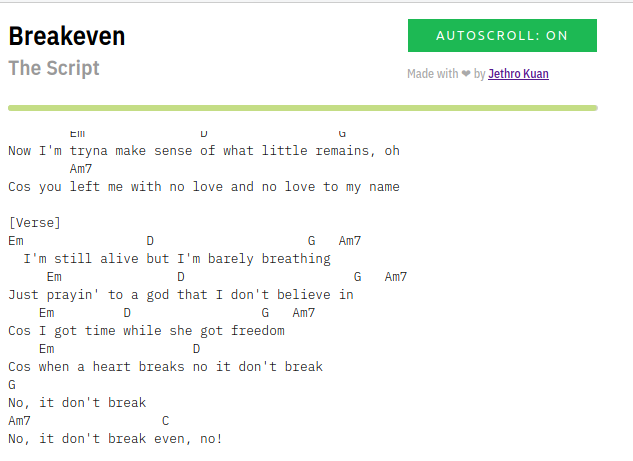

# Jita - Play along with songs on Spotify

Jita is a simple web application that shows the tab for the currently playing
song on Spotify. It also provides a rudimentary auto-scroll functionality that
scrolls the page based on the song's current playing progress, allowing the user
to play along to songs without ever touching the app.

Thanks to:

- [Pixel Perfect](https://www.flaticon.com/authors/pixel-perfect) for the pick icon
- [Ultimate Guitar](https://www.ultimate-guitar.com) for the tabs...
